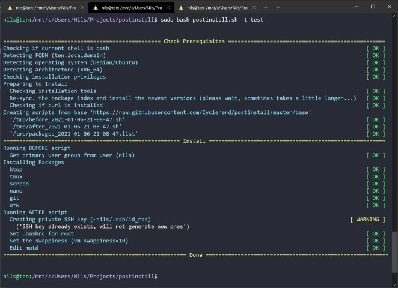

# postinstall.sh

[](https://travis-ci.org/Cyclenerd/postinstall)

Bash Script to automate post-installation steps.
Helps to install packages on different operating systems.


Puppy, Cygwin and Haiku are also supported.

## Overview

`postinstall.sh` is simple bash shell script which in turn generates scripts.
The generation depends on the operating system and type of installation.
The templates that are included in the generation can be stored in the file system or on a web server.
This can also be your GitHub repository.
Just fork this repository and edit it according to your needs.

`postinstall.sh` is not a configuration management system.
If you want to install many servers automatically, you should look at [ansible](https://github.com/ansible/ansible).
But if you want to quickly reinstall your laptop or Raspberry Pi, `postinstall.sh` can help you.

__Please check the [Wiki](https://github.com/Cyclenerd/postinstall/wiki/postinstall.sh) for more information.__


## Installation

Download:

```
curl -f https://raw.githubusercontent.com/Cyclenerd/postinstall/master/postinstall.sh -o postinstall.sh
```

Alternative download with short URL:

```
curl -fL http://bit.ly/get_postinstall -o postinstall.sh
```

Create a package lists and scripts as explained in this [repository](https://github.com/Cyclenerd/postinstall/tree/master/base) or in the [Wiki](https://github.com/Cyclenerd/postinstall/wiki/postinstall.sh).

Example:

```
mkdir install
cd install
vi packages.list
```

Run as root:

```
bash postinstall.sh -b install
```

## Usage

```
Usage: postinstall.sh [-t <TYPE>] [-b <BASE>] [-h]:
        [-t <TYPE>]      sets the type of installation (default: server)
        [-b <BASE>]      sets the base url or dir (default: https://raw.githubusercontent.com/Cyclenerd/postinstall/master/base)
        [-h]             displays help (this message)
```

Example: `postinstall.sh` or `postinstall.sh -t workstation`


## Screenshot




## Program Flow

* Determine operating system and architecture
* Check package manager and requirements
* Generate script to run before and after installation and list of packages to install
* Install packages


## Requirements

Only `bash`, `curl`, `tput` (`ncurses-utils`) and a package manager for the respective operating system:

* Alpine Linux              → `apk`
* Apple macOS               → `port` or `brew`
* Arch Linux                → `pacman`
* Cygwin                    → `apt-cyg`
* Debian / Ubuntu           → `apt-get`
* FreeBSD                   → `pkg`
* Haiku                     → `pkgman`
* Mageia                    → `urpmi`
* NetBSD                    → `pkg_add`
* OpenBSD                   → `pkg_add`
* OpenWRT                   → `opkg`
* Puppy                     → `pkg` (https://gitlab.com/sc0ttj/Pkg)
* Red Hat / Fedora / CentOS → `dnf` or `yum`
* Slackware                 → `slackpkg`
* SUSE / openSUSE           → `zypper`
* Termux                    → `pkg`


## TODO

* More and better documentation
* Support for even more operating systems and package managers

Help is welcome 👍


## License

GNU Public License version 3.
Please feel free to fork and modify this on GitHub (https://github.com/Cyclenerd/postinstall).
